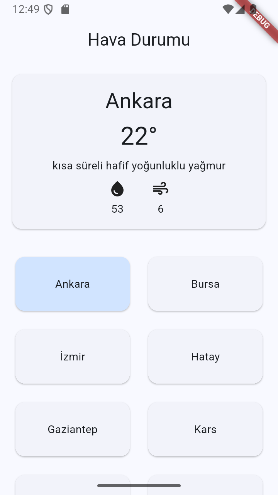
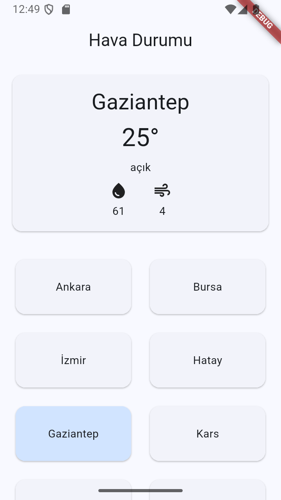

# ☀️ Hava Durumu Uygulaması 
Bu proje, Flutter kullanılarak geliştirilen basit ve modern bir hava durumu uygulamasıdır.  
Kullanıcı seçtiği şehirlerin hava durumu bilgilerini **OpenWeatherMap API** üzerinden anlık olarak alabilir.

## 🧩 Özellikler
- 🌆 Şehir seçimine göre anlık hava durumu bilgisi alma  
- 🌡️ Sıcaklık, açıklama, nem ve rüzgar hızı gösterimi  
- 🟦 GridView ile şehir seçimi ve seçilen şehrin vurgulanması  
- 🌐 API ile dinamik veri çekimi (OpenWeatherMap)  
- 🧱 Modern arayüz

## 🔧 Kullanılan Teknolojiler
- [Flutter](https://flutter.dev/)  
- Dart  
- Dio (HTTP client paketi)  
- OpenWeatherMap

<h3>📸 Ekran Görüntüleri</h3>

  
  &nbsp;&nbsp;
  

👨‍💻 Geliştirici
- Adı: Harun Mercan
- Eğitim: Gazi Üniversitesi - Bilgisayar Mühendisliği

 
